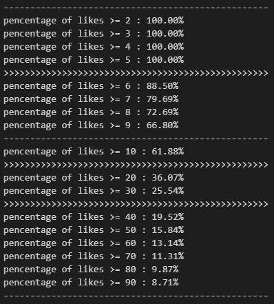
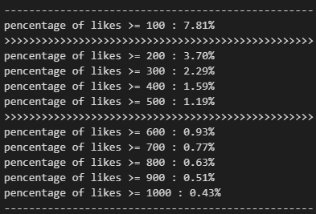
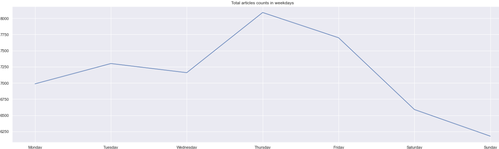
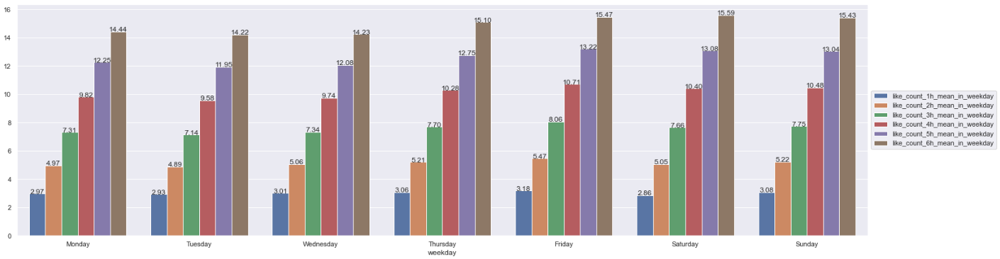
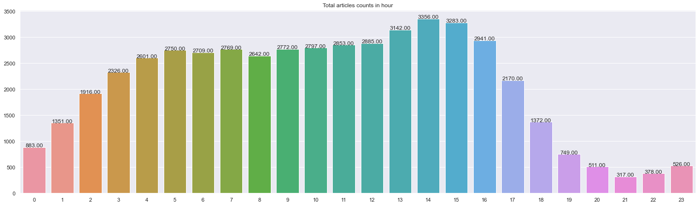
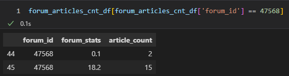
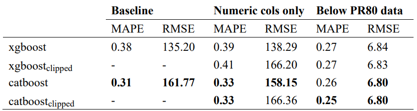
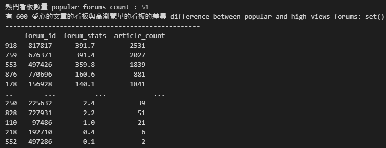
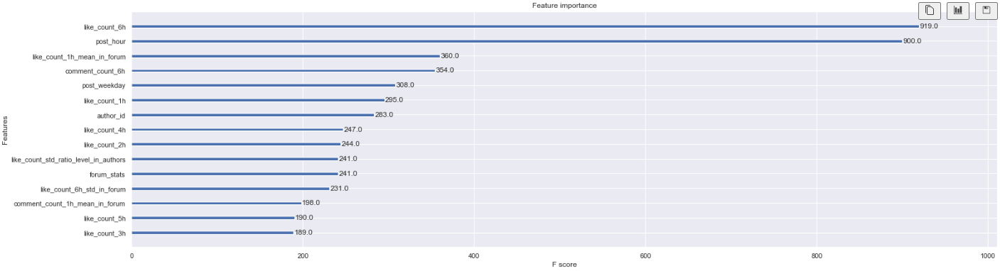

# dcard_ML_intern_hw

## Idea
根據各 feature 進行不同面向的拆解，觀察 forum、author 與 post timing 對 likes_count 的影響。

## EDA
Like 數的分佈情況 :

星期四的發文數量最多。

星期五的like_count_1h_mean最多，like_count_6h的話是星期六最多。

下午文章比上午多，下班時間(18~21點)文章數量激減，凌晨不睡覺(1~6點)在發文的人意外的非常多。

一個月只有一篇文的看版數量: 398, 佔全體看板  34.669 %。
只發一篇的作者: 25323 位，佔總文章比例  50.647%。
發多篇的作者: 6957 位，佔總文章比例  49.353%，平均一人發  3.547 篇文。

## Abnormal value handling
EDA的過程中發現有一個 forum 的 forum_stats 有兩個值，最後統一改併為 18.2。
 

## Feature Engineering
### Forum
*	article_count : 看板文章數量
*	like_count_1h_sum_in_forum, like_count_1h_mean_in_forum, like_count_1h_std_in_forum : 看板平均文章發佈後1小時的累積/平均/標準差愛心數
*	like_count_2h_sum_in_forum, like_count_2h_mean_in_forum, like_count_2h_std_in_forum : 看板平均文章發佈後2小時的累積/平均/標準差愛心數
*	like_count_3h_sum_in_forum, like_count_3h_mean_in_forum, like_count_3h_std_in_forum : 看板平均文章發佈後3小時的累積/平均/標準差愛心數
*	like_count_4h_sum_in_forum, like_count_4h_mean_in_forum, like_count_4h_std_in_forum : 看板平均文章發佈後4小時的累積/平均/標準差愛心數
*	like_count_5h_sum_in_forum, like_count_5h_mean_in_forum, like_count_5h_std_in_forum : 看板平均文章發佈後5小時的累積/平均/標準差愛心數
*	like_count_6h_sum_in_forum, like_count_6h_mean_in_forum, like_count_6h_std_in_forum : 看板平均文章發佈後6小時的累積/平均/標準差愛心數
*	comment_count_1h_sum_in_forum, comment_count_1h_mean_in_forum, comment_count_1h_std_in_forum : 看板平均文章發佈後1小時的累積/平均/標準差留言數
*	comment_count_2h_sum_in_forum, comment_count_2h_mean_in_forum, comment_count_2h_std_in_forum : 看板平均文章發佈後2小時的累積/平均/標準差留言數
*	comment_count_3h_sum_in_forum, comment_count_3h_mean_in_forum, comment_count_3h_std_in_forum : 看板平均文章發佈後3小時的累積/平均/標準差留言數
*	comment_count_4h_sum_in_forum, comment_count_4h_mean_in_forum, comment_count_4h_std_in_forum : 看板平均文章發佈後4小時的累積/平均/標準差留言數
*	comment_count_5h_sum_in_forum, comment_count_5h_mean_in_forum, comment_count_5h_std_in_forum : 看板平均文章發佈後5小時的累積/平均/標準差留言數
*	comment_count_6h_sum_in_forum, comment_count_6h_mean_in_forum, comment_count_6h_std_in_forum : 看板平均文章發佈後6小時的累積/平均/標準差留言數

### Author
*	top_author_in_authors : 頂尖作者 (多篇作者中的平均 like 有 PR75 以上)
*	like_count_popularity_level_in_authors : 高 like 作者 (mean 高於所有文章的 like 平均)
*	like_count_std_ratio_level_in_authors : 高爆發力作者 (std / like count)
*	post_lovers_in_authors : 發文狂魔 (article_count 高於多篇作者的中位數)

### Post timing
*	post_weekday : 發文是星期幾
*	post_hour : 發文是幾點
*	post_timing_below_PR80_level : 根據發文時間切below_PR80的1~4 level
*	post_timing_over_PR80_level : 根據發文時間切over_PR80的1~4 level

## Model & Experiments

註 : Below PR80 data 是根據 like_count_24h 排百分位數 (quantile)，然後只選取 quantile=0.8 以下的資料做為 training data 去建立模型。Clipped 代表根據 like_count_24h 排百分位數(quantile)，然後將結果強制固定在 quantile=0.8 的範圍內。

## Insights
有 600 愛心的文章的看板與高瀏覽量的看板的完全重疊，代表如果想要自己的文章有 600 顆愛心的話就要發在高瀏覽量的看板上。

利用 xgboost 自身所帶的 feature importance 可得知特徵重要性，前六名分別是 like_count_6h、post_hour (發文時間)、like_count_1h_mean_in_forum(看板平均文章發佈後1小時的累積愛心數)、post_weekday (發文是星期幾)、like_count_1h 與 author_id，因此如果想要得到高愛心數的話可以特別注重這幾點。

# Conclusion
在這個 project 裡面，我們首先進行了 EDA，發現了一些有趣的事實。

再來我們對 EDA 的結果做 feature engineering，產生了總共 46 個新 features，其中38個是關於看板(forum) 的，4 個關於發文時間點 (post timing) 的 features 以及 4 個關於作者 (author)。

建 model 時我們考量到有類別特徵 (categorical features) 的存在，因此採用了兩種流行的 boosting model — xgboost和catboost。從Baseline的結果可以發現在此資料集中 catboost 的表現優於 xgboost。

此外我們也透過 Below PR80 data 和 Clipped 的建模方式和技巧成功將 MAPE 降低 0.11 (xgboost)，RMSE 降低 154.97 (catboost)。
# Future Works
因為時間緊迫所以沒辦法十全十美 (…🥲)，以下依重要性列出幾點可以再改善的部分 : 
1.	Title 利用 NLP 做 feature engineering，例如 sentiment analysis、clickbait detector等等
2.	Refactor code，整併為一個大 pipeline
3.	Feature selection，進一步將沒用的features移除掉
4.	Hyperparameter tuning，也就是調參
